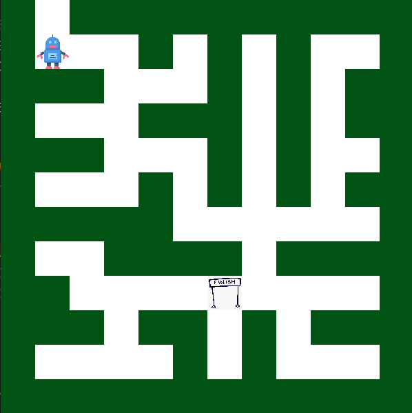

# Maze solver

In this program, a robot explores a maze to arrive at destination. 

The maze generation code is located in the package `lib.maze`.
* To select a predefined maze, use `lib.maze.predefined_maze()`
* To select a randomly generated maze, `use maze.randomMaze(a, b)`

This code also contains two main classes inheriting from `pygame.sprite.Sprite`, the class `Player` and the class `Target`. They are both located in `lib.player`.

* The class `Player`: It is the class responsible for the player's appearance and movements. It contains the following methods:
  * `__init__`: The constructor, it initializes an instance of the class.
  * `explore` : A method responsible for the movement of the robot
  * `get_available_moves`: A method responsible for returning all the available move at a certain positions. This function checks if there is walls in the the neighboring cells and eliminate the possibility of moving towards them.
  * `get_neighbors`: A function that returns all the neighbors of the player at a given position (see the figure below to understand how it functions).
  * `checkCollision`: Checks if the player collided with the target.
  * `move_right`
  * `move_left`
  * `move_up`
  * `move_down`

* The class `Target`: It is the class responsible for the target's appearance and position. In this exercise, the target doesn't move, it will appear always on the same exact position of the maze.

The `main` function contains the necessary routines to run the pygame window, to create instances of the `Player` and `Target` classes and to call the methods responsible for the movements.

We can use a movements matrix to record the visited neighbor:

* `get_available_moves`: Given a `neighbors_list`, **return all the available moves from the list of available moves**.

> The zeros in the `neighbors_list` corresponds to the empty cells (no walls), and the cells with value "1" are considered walls as illustrated in the figure below:

* The `explore()` method works as follows:
  1. The maze is a matrix,  you can check it by printing its value. Each position of the player on the screen corresponds to a given cell in the matrix (row and column indexes). **Get these indexes given the player's position**.
  2. Mark the cell in the maze as already visited (you can fill the cell with a value = -1)
  3. From the list of available moves, choose randomly one move and call it.

An example of a randomly generated maze is as follows:

In this case, the `Player` should move in a more intelligent way to reach the target. The end goal is to achieve the scenario in the animation shown above.

As it moves, the robot will always check for available moves using the function `get_available_moves()`. You can mark the already visited cells in the matrix as "-1", instead of "0" (empty cell) or "1" (Wall). This way, you can keep track of the cells you already visited.
You can also use an array or list to store the visited positions.
